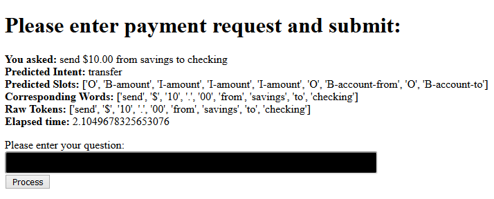

# Intent slot model used in artificial assistant in the bank or similar industry. Implemented Tensorflow with instructions how to run to run on GCP.

This is an implementation of "BERT for Joint Intent Classification and Slot Filling" - arXiv:1902.10909v1  [cs.CL]  28 Feb 2019.

Also, this work targets gcp and TPU used for training. It can be run off AWS or Azure, but some migration work will be needed. 

Joint training using BERT with loss calculated as total loss from intent and slots. Objective function is calculated as in equation (3) in the arcticle. 

Please make yourself familiar with BERT: Pre-training of Deep Bidirectional Transformers forLanguage Understanding - arXiv:1810.04805v2  [cs.CL]  24 May 2019

BERT is extended to train model for joint intent and slots. In BERT for problem like this, we use first model output as classifier and other outputs can be used as output tokens for translation problem, for example. So we use first token for intent classification and other tokens for slots. The challenge is that BERT uses sub-tokens, so it some alignment strategy is pursued. See the code!

Data used in this work:

- SNIPS Voice Platform: an embedded Spoken Language Understanding system for private-by-design voice interfaces - arXiv:1805.10190v3  [cs.CL]  6 Dec 2018 
- An Evaluation Dataset for Intent Classification and Out-of-Scope Prediction - arXiv:1909.02027v1  [cs.CL]  4 Sep 2019

Snips dataset contains labels for both intent and slots and "Out-of-Scope Prediction" has data related to financial domain without slot labels and some of this data was labeled manually and merged with SNIPS. This works is intented for some financial domain and this is the reason that "Out-of-Scope Prediction" was taken advantage of.

Contains of the repository:

- run_intent_slot.py script in bert forder is used the same way as BERT's run_classifier.py. This script contain actual Tensorflow implementation of this joint model

- data folder: train.tsv, dev.tsv, test.tsv. All of them have sentence, intent_label, slot labels separated by tab. But sentence tokens and slot label tokens are separated by space. 

Intents and slot labels came from SNIPS for: 
- AddToPlaylist
- BookRestaurant
- GetWeather
- PlayMusic
- RateBook
- SearchCreativeWork
- SearchScreeningEvent

These are not a financial domain, but just to have more intents to work with. Also, they can be considered Out-of-Scope intents. Remove them when you have plenty of domain intents.

Slot are manually labeled for:
- bill_due
- report_fraud
- transfer

- train folder has three scripts: INTENT_SLOT.deployment, INTENT_SLOT.evaluate, INTENT_SLOT.predict:
	- evaluate is used for both training and evaluation using train.tsv and dev.tsv data files
	- predict uses test.tsv
	- deployment creates saved_model.pb file and variables which are used to deploy model is a way so it can be used for online prediction

- assistant/deploy/deploy_intent_slot.sh deploys SavedModel.pb model with variables to gcp ai platform
- assistant/functions/intent_slot contains function that is fronting model and provides better interface for consuming application
- assistant/functions/deploy_function.sh deploys function to gcloud 
- assistant/appengine/intent_slot contains sample application to invoke function to run intent_slot prediction

Steps:

1. Create gcp project, create simple VM instance, use standard 2-4 cpu, debian 9 deep learning TF 1.15. Create TPU instance, TF 1.15, preemptive (but keep it off until you start training!)
2. Create ai model (actual model version will be deployed later): `gcloud beta ai-platform models create --enable-console-logging --enable-logging --description "intent slots" intent_slot`. This can be done from gcp console as well
2. Get BERT and it should be in the bert folder. Put run_intent_slot.py into this folder as well
3. Get gcp storage, create test folders test/pretrained/uncased_L-12_H-768_A-12/ and put unzipped BERT pretrained uncased_L-12_H-768_A-12 model content there. Use gsutil cp
4. Create service account key. Please refer to https://cloud.google.com/docs/authentication/getting-started. Key will be stored in json file and move it to assistant/functions/intent_slot folder
5. Set varibles GCP_PROJECT_ID as your gcp project is, TPU_NAME as name of your tpu instance, INTENT_SLOT_FOLDER points to the root folder of this software, GOOGLE_APPLICATION_CREDENTIALS is the name of the key file created in Step 4 (not path, but file name)
6. Start TPU. Go to train folder and run: sh INTENT_SLOT.evaluate. Shutdown TPU, not needed any more. Output will look like below. Accuracy similar to what is in the article:
`I0421 18:07:35.874321 140401829115648 estimator.py:2039] Saving dict for global step 1255: global_step = 1255, intent_accuracy = 0.9894737, intent_loss = 0.062348537, loss = 3.2194374, slot_accuracy = 0.96710986, slot_lm_loss = 0.19705378
I0421 18:07:38.343356 140401829115648 estimator.py:2099] Saving 'checkpoint_path' summary for global step 1255: gs://__PROJECT_ID__.appspot.com/test/intent_slot_output/uncased_L-12_H-768_A-12/model.ckpt-1255
I0421 18:07:38.692619 140401829115648 error_handling.py:96] evaluation_loop marked as finished
I0421 18:07:38.692969 140401829115648 run_intent_slot.py:988] ***** Eval results *****
I0421 18:07:38.693127 140401829115648 run_intent_slot.py:990]   global_step = 1255
I0421 18:07:38.693519 140401829115648 run_intent_slot.py:990]   intent_accuracy = 0.9894737
I0421 18:07:38.693676 140401829115648 run_intent_slot.py:990]   intent_loss = 0.062348537
I0421 18:07:38.693834 140401829115648 run_intent_slot.py:990]   loss = 3.2194374
I0421 18:07:38.693990 140401829115648 run_intent_slot.py:990]   slot_accuracy = 0.96710986
I0421 18:07:38.694137 140401829115648 run_intent_slot.py:990]   slot_lm_loss = 0.19705378`
7. (Optional) From train folder, run: sh INTENT_SLOT.predict. This is to predict intents and slots for test.tsv file. Output will be in gcp storage folder test/intent_slot_output/uncased_L-12_H-768_A-12/predict
8. From train folder, run: sh INTENT_SLOT.deployment. Output is model in SavedModel.pb format and variables folder. This model is for online predictions, ready to be deployed to gcp ai platform. Output will has number - folder name. It will be used in Step 9
`I0421 18:59:58.103994 139887238223616 builder_impl.py:421] SavedModel written to: gs://__PROJECT_ID__.appspot.com/test/intent_slot_output/uncased_L-12_H-768_A-12/deployment/temp-b'1587495558'/saved_model.pb`
9. Go to assistant/deploy/ and run: sh deploy_intent_slot.sh 1587495558. Again, number-parameter, take from previous step. It will deploy your model to gcp ai platform. 
10. Go to assistant/functions/intent_slot and run: sh ../deploy_function.sh intent_slot
Output will contain httpsTrigger. This url will be used in step 10. Please make "Allow unauthenticated" for this function from gcp console. See "Managing Access via IAM" section to do it in few steps. For production deployment, secure this! 
11. Go to assistant/appengine/intent_slot. Edit app.yaml and update INTENT_SLOT_URL. Use httpsTrigger from previous step. Application have to be enabled on gcp Appengine (It is enabled in Settings section). After this, run: gcloud beta app deploy 
Use target URL to acceess deployed application
To see application logging, use: gcloud app logs tail -s default
Submit form with sentence like this to see intents and slots: send $10.00 from savings to checking

12. After all done:
- Disable application in appengine
- Delete model in ai platform or delete version, this is what is billed
- Delete function
